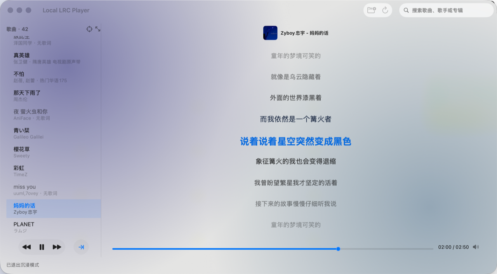
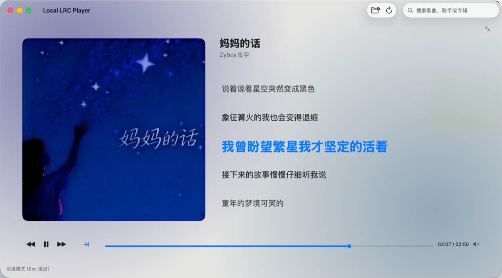
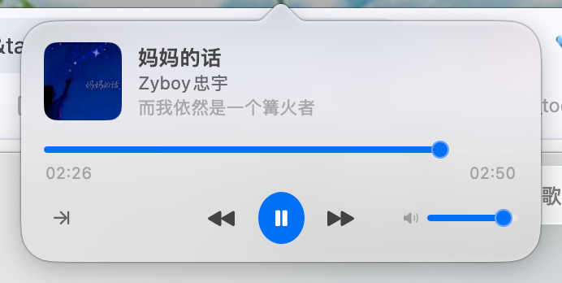
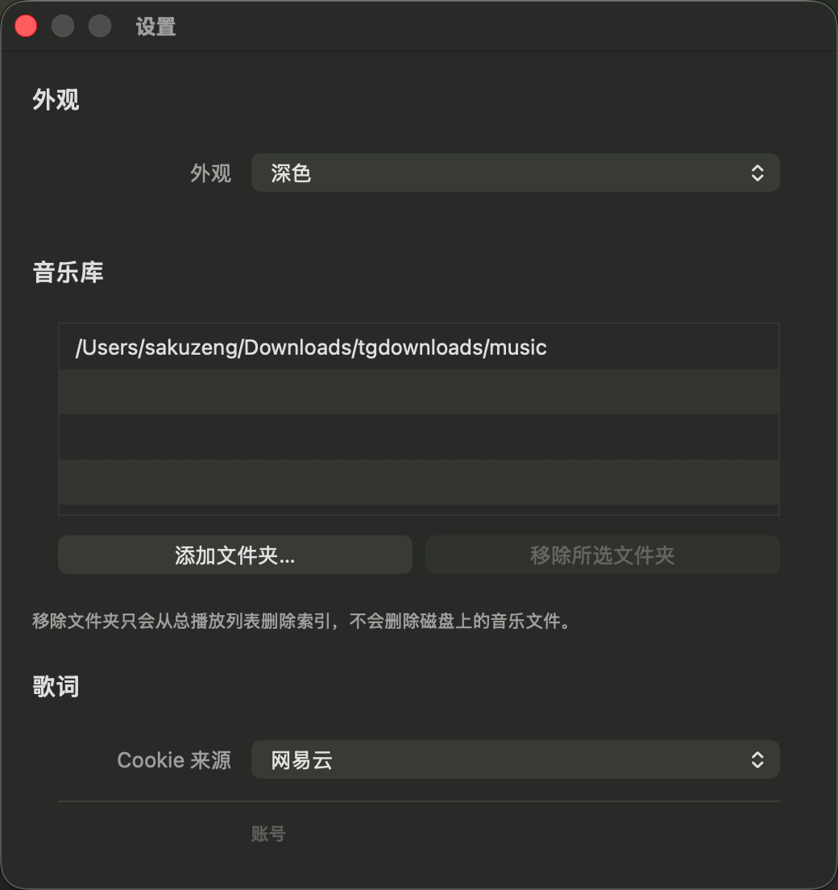

# Local LRC Player

一个轻量原生 macOS 本地音乐播放器，用于播放本地音乐并显示同名 `.lrc` 同步歌词。

## 预览

主窗口（曲目列表 + 同步歌词，封面主色氛围背景）：



沉浸模式（⌘⇧F，大封面 + 放大左对齐歌词 + 底部控制行）：



菜单栏悬停卡片（停在菜单栏歌词上 0.3s 弹出）：



设置窗口（音乐库 + 歌词 Cookie/下载）：



## 功能

### 播放与列表

- 选择本地音乐文件夹；多次选择不同文件夹时，曲目累积到总播放列表（同文件内容只保留一条）。
- 扫描并显示本地音乐列表（双行：歌名 + 歌手/专辑；支持「歌手 - 歌名」拆分）。
- 播放、暂停、上一首、下一首；播放模式：顺序（末首回第一首）、单曲循环、随机（偏好持久化）。
- 拖动进度条跳转播放位置；列表列底栏传输控制 + 歌词列底栏进度条（与歌词区左右对齐）。
- 进度条悬停时轨道增高，并在指针位置显示时间气泡（拖动时跟随圆点）。
- 歌词区顶部显示正在播放信息：封面缩略图 + 歌名/歌手；封面优先读音频内嵌图，没有则用已配置 Cookie 的歌词源自动下载专辑图（只写本地缓存，不改音频文件），都没有时显示占位音符。
- 音量控制：进度条行右端喇叭按钮，点击弹出竖向滑杆；音量持久化，重启后保持。
- 列表顶栏显示 歌曲 · N，定位正在播放（`scope`）可滚动到当前曲；搜索过滤时会先清空搜索。
- 歌曲列表搜索（歌名、歌手、专辑）；悬停高亮；播放行主题色浅底标识。
- 记住上次音乐库、曲目、播放进度与主窗口位置/大小；再次打开时恢复选中与进度（含进度条位置与当前/总时长显示），不自动播放。

### 歌词

- 读取同目录同名 `.lrc` 歌词；按播放进度高亮当前行（放大加粗主题色）并平滑滚动。
- 非当前行按距离渐变淡出；首尾行可滚到视口正中。
- 点击任意歌词行直接跳到该行时间（未加载播放时先记住位置，播放从该处开始）。
- 多语种歌词原文与译文同时显示（原文在上、中文译文在下）；高亮默认落在中文译文行。

### 歌词下载

- 网易云 / QQ 音乐搜索并下载缺失的同名 `.lrc`（需各自 Cookie）。
- 下载当前歌词：双源候选预览与手动选择；补全缺失歌词：按匹配分自动尝试。
- Cookie 保存于本机私有配置文件（非 Keychain）。

### 界面与其它

- 设置（⌘,）：音乐库（添加/移除文件夹）、歌词 Cookie 与下载、菜单栏歌词。
- 主窗口 NSToolbar：选择文件夹、刷新、搜索（详见 [doc/ui.md](./doc/ui.md) 工具栏分段说明）。
- 毛玻璃背景、透明标题栏；列表/歌词空状态 SF Symbol 占位。
- 氛围背景：窗口底色随当前封面主色晕染（两团柔和色斑，切歌淡入淡出）；无封面时保持纯毛玻璃。
- 沉浸模式（⌘⇧F）：藏起曲目列表，左侧大封面 + 右侧歌名/歌手与放大左对齐的歌词 + 底部一整行播放控制；Esc、再按 ⌘⇧F 或右上角收起按钮退出。不持久化，启动总是普通模式。
- 菜单栏歌词：关窗后后台继续显示当前行；宽度为上限（预设 120/140/160 pt 或自定义 80–400 pt），短句随内容收缩；长句播放时滚至末尾停下；点击弹出浅色控制菜单。macOS 26 需在「系统设置 → 菜单栏」允许本应用显示。
- 菜单栏悬停卡片：鼠标停在菜单栏歌词上 0.3s 弹出正在播放卡片（封面、歌名/歌手、当前歌词、可拖动进度条、上一首/播放暂停/下一首、播放模式、音量），移开自动收起。多显示器下只有当前聚焦那块屏会弹出。
- 标准 macOS 菜单栏与常用快捷键（⌘Q、空格播放/暂停等）。
- FLAC 播放优先同名 `.m4a`，否则 `ffmpeg` 转 ALAC 缓存以保证 seek 准确。
- 本地 SQLite 索引音乐库与曲目（ID3、歌词有无、播放历史等）；总列表按库顺序 + 显示名自然排序（⌘R 刷新后更新）。

## 构建

需要本机可用 Swift 编译工具链，并链接系统 SQLite3。FLAC 自动转 ALAC 缓存依赖 Homebrew 安装的 `ffmpeg`：

```bash
brew install ffmpeg
```

```bash
cd /Users/sakuzeng/improve/coding/mac_app/local-lrc-player
./test.sh    # 运行数据库测试并构建 App
./build.sh   # 仅构建
```

构建产物：

```text
/Users/sakuzeng/improve/coding/mac_app/local-lrc-player/build/LocalLrcPlayer.app
```

也可以直接打开：

```bash
open /Users/sakuzeng/improve/coding/mac_app/local-lrc-player/build/LocalLrcPlayer.app
```

## 使用

1. 打开 `build/LocalLrcPlayer.app`。
2. 点击 `选择文件夹`。
3. 选择包含音乐文件的目录，例如：

   ```text
   /Users/sakuzeng/Downloads/tgdownloads/music
   ```

4. 可继续选择其他文件夹（或 ⌘, 打开设置添加），歌曲会追加到同一总列表（内容相同的副本自动去重）。
5. 双击左侧歌曲开始播放。
6. 单击选中某行；若选中的是另一首，按空格或点「播放」会切换到该曲；若选中的是正在播放的同一首，则暂停/继续。
7. 列表列底栏切换播放模式（顺序 / 单曲循环 / 随机）；歌词列底栏拖动进度条；顺序模式下末首播完会从第一首继续。
8. 列表顶栏 scope 按钮可定位到正在播放的歌曲（若被搜索过滤会先清空搜索）。
9. 可用搜索框过滤歌曲（点击列表或歌词区可让搜索框失焦）；新增音乐或歌词后点「刷新」即可同步全部已注册文件夹。不再需要的文件夹可在 ⌘, 设置中移除（仅删索引，不删磁盘文件）。

列表行样式（双行：歌名 + 歌手/专辑）：

| 状态 | 外观 |
|---|---|
| 仅选中（未播放） | 悬停浅灰底；歌名中等字重 |
| 正在播放 | 主题色浅底 + 歌名加粗 |
| 选中且正在播放 | 同上，以播放样式为主 |

常用快捷键：

| 快捷键 | 功能 |
|---|---|
| ⌘Q | 退出 |
| ⌘W | 关闭窗口 |
| ⌘O | 选择文件夹 |
| ⌘, | 打开设置 |
| ⌘R | 刷新全部已注册文件夹 |
| ⌘M | 最小化 |
| 空格 | 选中其他歌曲时播放选中项；选中正在播放的同一首时暂停/继续 |
| ⌘[ / ⌘] | 上一首 / 下一首 |
| ⌘⇧F | 沉浸模式（Esc 退出） |
| ⌘⇧? | 帮助 |

## 本地数据

App 数据保存在 `~/Library/Application Support/LocalLrcPlayer/`：

| 文件 | 用途 |
|---|---|
| `LocalLrcPlayer.sqlite` | 音乐库、总播放列表、曲目索引（含内容哈希去重）、播放历史、歌词下载审计 |
| `netease-cookie.txt` | 网易云 Cookie |
| `qqmusic-cookie.txt` | QQ 音乐 Cookie |

歌词和音频仍以你选择的音乐文件夹内文件为准（同名 `.lrc`）；数据库只是索引与历史，不是第二份歌词。

数据库表结构、主键/外键与读写流程见 [doc/database.md](./doc/database.md)。主窗口 UI 与工具栏约定见 [doc/ui.md](./doc/ui.md)。

## 下载歌词

当前支持两个歌词源：

- 网易云：需要先设置 Cookie。
- QQ 音乐：需要先设置 Cookie。

使用步骤（在 ⌘, 设置 → 歌词 中操作）：

1. 选择 `Cookie 来源`：`网易云` 或 `QQ音乐`（仅用于设置/重置对应 Cookie，不影响下载或补全时的搜索范围）。
2. 点击 `设置…Cookie`，粘贴当前歌词来源对应网站登录后的 Cookie。
3. 回到主窗口，选择一首没有歌词的歌曲。
4. 在设置中点击 `下载当前歌词`，App 会同时搜索已设置 Cookie 的网易云和 QQ 音乐，并在同一个候选窗口按来源展示结果。
5. 点击候选结果预览歌词，确认后点击 `保存所选歌词`。

也可以点击 `补全缺失歌词`，App 会串行处理总播放列表里所有没有同名 `.lrc` 的歌曲。

下载规则：

- `下载当前歌词` 会同时搜索已设置 Cookie 的网易云和 QQ 音乐，在同一个候选窗口按来源分组展示；只设置了一个来源 Cookie 时只搜索该来源。
- `下载当前歌词` 支持预览和手动选择；保存时会覆盖当前歌曲已有的同名 `.lrc`。
- `补全缺失歌词` 会同时搜索已设置 Cookie 的网易云和 QQ 音乐，按匹配分从高到低依次尝试，直到成功获取歌词并保存（单首最多尝试 8 个高分候选）。同分时先尝试网易云候选，拉取失败则自动试下一个；两个来源都有 100 分但一个无歌词时，会跳过无歌词的、保存第一个成功返回的。
- 只写入缺失的同名 `.lrc`（仅适用于补全缺失歌词）。
- 不覆盖已有 `.lrc`。
- 保存时会自动去掉行首的歌手名或角色前缀（如 `田翌臣: `、`合: `），只保留歌词正文。
- 匹配分数过低时不保存，避免写入明显错误的歌词。
- 匹配分基于规范化后的歌名与 API 返回的歌手计算：歌名会从混杂字段中提取后再比对；歌手仅认 API `artists`，且与本地歌手完全一致才加分。
- 下载成功后会刷新当前目录，左侧“无歌词”标记会更新。

Cookie 保存位置：

```text
~/Library/Application Support/LocalLrcPlayer/netease-cookie.txt
~/Library/Application Support/LocalLrcPlayer/qqmusic-cookie.txt
```

文件权限会设置为仅当前用户可读写。

多语种输出规则：

- 优先输出原文。
- 如果歌词来源返回翻译歌词，则在同一时间戳后追加译文。
- 如果网易云返回英文译文，则继续追加英文译文。
- 播放显示时，原文和中文译文会同时显示，顺序固定为原文在上、中文译文在下；日文歌为日文在上，英文歌为英文在上；高亮默认落在中文译文行。
- 格式示例：

  ```text
  [00:00.230]君と夏の終わり　将来の夢
  [00:00.230]与你在夏末约定　将来的梦想
  [00:00.230]Ten years later in August
  ```

## 歌词规则

歌词文件必须和音乐文件在同一个目录，并且主文件名相同：

```text
要不要买菜 - 下山.flac
要不要买菜 - 下山.lrc
```

支持标准 LRC 时间轴格式：

```text
[00:15.04]要想练就绝世武功
[00:16.98]就要忍受常人难忍受的痛
```

一行多个时间戳也支持：

```text
[00:15.04][01:20.10]重复的一句歌词
```

## 支持格式

- `.mp3`
- `.m4a`
- `.flac`
- `.wav`
- `.aac`
- `.aiff`
- `.aif`

## 项目结构

```text
Sources/LocalLrcPlayer/
  AppDatabase.swift             SQLite 连接与 schema 迁移（v3）
  PlaybackMode.swift            播放模式枚举
  TrackContentHasher.swift      文件 SHA256
  PlaylistRepository.swift      总播放列表
  PlayerStateRepository.swift   播放进度、窗口 frame、播放模式
  LibraryRepository.swift       音乐库 register / delete / 列表
  TrackRepository.swift         曲目 sync、去重、总列表查询
  AppSettingsRepository.swift   菜单栏歌词等 UI 设置
  PlayHistoryRepository.swift   播放历史
  LyricLogRepository.swift      歌词下载审计
  DatabaseModels.swift          数据库记录模型
  TrackMetadataReader.swift     AVAsset 读取 ID3 元数据
  SettingsWindowController.swift  设置窗口（⌘,）
  PlayerWindowToolbar.swift     主窗口 NSToolbar
  UIChrome.swift                空状态、Symbol 工具
  MenuBarLyricsController.swift 菜单栏歌词与快捷菜单
  MenuBarLyricsStatusImage.swift  菜单栏歌词位图（白字/居中/滚动）
  MenuBarNowPlayingCard.swift     菜单栏悬停正在播放卡片
  MenuBarStatusItemVisibility.swift  NSStatusItem 可见性恢复
  MenuBarVisibilityGuide.swift    macOS 26 菜单栏权限引导
  LibraryBookmarkStore.swift      音乐库 Security-Scoped Bookmark
  MenuBarLyricsView.swift       （遗留）自定义 NSView 绘制
  AppDelegate.swift             应用生命周期、About/Help
  AppMenuBuilder.swift          标准 macOS 菜单栏与快捷键
  main.swift                    App 启动入口
  PlayerWindowController.swift  主窗口：绑定、快捷键、焦点
  PlayerWindowController_Library.swift      音乐库加载与刷新
  PlayerWindowController_Playback.swift     播放、进度、歌词、播放模式
  PlayerWindowController_LyricsDownload.swift  歌词下载与补全
  PlayerWindowLayout.swift      主窗口布局（列表顶栏、播放区）
  TrackListDataSource.swift     曲目列表、播放行样式
  PlaybackController.swift      AVPlayer 播放封装
  PlaybackAssetResolver.swift   FLAC 播放与 ALAC 缓存
  LyricsView.swift              歌词显示、高亮、滚动
  LrcParser.swift               LRC 解析
  MusicLibrary.swift            音乐目录扫描
  SeekSlider.swift              自定义进度条
  CookieStore.swift             歌词 Cookie 本地保存
  NetEaseLyricClient.swift      网易云搜索与歌词接口
  QQMusicLyricClient.swift      QQ 音乐搜索与歌词接口
  LyricSearchService.swift      歌词搜索、评分与下载协调
  LyricCandidateDialog.swift    候选歌词预览与选择
  LyricFormatter.swift          多语种歌词格式化
  LyricFileWriter.swift         同名 .lrc 写入
  Result+Success.swift          Result 便捷扩展
```

## 开发

本项目不使用 Xcode 工程、Swift Package 或第三方依赖，直接通过 `swiftc` 编译，并链接系统 `SQLite3`。新增 Swift 文件后不需要手动改编译列表，`build.sh` 会自动收集：

```text
Sources/LocalLrcPlayer/**/*.swift
```

每次修改后运行：

```bash
./build.sh
```

## 常见问题

### 再次打开 App 就自动播放

当前版本启动时只恢复上次选中的歌曲和进度条位置，并显示上次进度与曲目总时长（来自 ID3/数据库），不会自动播放。需要手动点「播放」或按空格才会开始。

### 搜索框一直亮着 / 无法失焦

启动时默认焦点在歌曲列表，不在搜索框。点击列表、歌词区或工具栏按钮后，搜索框会失焦；只有点击搜索框本身才会进入输入状态。

## 设置

按 ⌘, 或菜单 Local LRC Player → 设置… 打开设置窗口（会显示在主窗口所在屏幕）。

| 区块 | 内容 |
|---|---|
| 音乐库 | 已注册文件夹列表；添加文件夹；移除所选（仅删数据库索引） |
| 歌词 | Cookie 来源、设置/重置 Cookie、下载当前歌词、补全缺失歌词 |
| 菜单栏歌词 | 开关、最大宽度预设/自定义（80–400 pt）、音符图标 |

### 菜单栏歌词不显示（macOS 26）

1. 打开 系统设置 → 菜单栏，确认 LocalLrcPlayer（或 Local LRC Player）已允许在菜单栏显示。
2. 完全退出（⌘Q）后重新 `./build.sh` 并打开 `build/LocalLrcPlayer.app`（当前 bundle 为 `local.lrc.player.v2`，相当于新应用身份）。
3. 若仍不显示，在应用内关闭再打开「在菜单栏显示歌词」。

### 每次启动都询问访问「下载」等文件夹

音乐库若在受 macOS 保护的目录（如「下载」），首次需点 允许。之后应通过 Security-Scoped Bookmark 记住授权；若仍反复弹出，请在应用内 ⌘O 或设置里重新选择该音乐文件夹一次以写入 bookmark。

### 搜索后播放，取消搜索找不到当前歌

搜索过滤后播放某首，再点搜索框 × 或删光关键字，总列表会按正在播放的文件路径重新定位该行（加粗 + 浅蓝背景），并滚动到可见区域。该标识不依赖表格选中态，点击歌词区等处不会消失。

### 有歌但没有歌词

确认是否存在同名 `.lrc` 文件，例如：

```text
银临 - 棠梨煎雪.flac
银临 - 棠梨煎雪.lrc
```

### 拖动进度条后歌词不同步

当前版本将拖动分为「预览歌词」与「松手后一次 seek」：`completeSliderSeek` 在播放器时间稳定前阻止 `tick()` 覆盖歌词。未播放时可用曲目/文件时长预览，松手会更新 `restoredPlaybackPosition`。启动恢复与点播放时会用 `highlightAt` / `updateWhenReady` 立即定位歌词。

对于 `.flac`，App 会优先使用同名 `.m4a`，没有时会用 `ffmpeg` 生成 ALAC 缓存再播放，因为 AVPlayer 直接播放 FLAC 时手动 seek 可能落点不准。

当前代码查找的 `ffmpeg` 路径是：

```text
/opt/homebrew/bin/ffmpeg
```

缓存位置在 macOS 用户缓存目录下：

```text
~/Library/Caches/LocalLrcPlayer/Transcoded
```

### 修改后打开还是旧效果

先退出当前 App，再重新构建并打开：

```bash
./build.sh
open build/LocalLrcPlayer.app
```

### 下载歌词时仍弹出钥匙串密码

新版已经不再使用 Keychain 保存 Cookie。请先退出旧 App，重新打开新版。如果仍弹出钥匙串密码，说明当前运行的还是旧版本。

### QQ 音乐候选始终为空 / 只有网易云有结果

2026-06-15 起搜索接口已改为 `musicu.fcg`，但请求里仍附带 `comm.ct=24&cv=0`（模拟 QQ 音乐桌面客户端）。QQ 音乐服务器后来对该参数组合改为「接口成功、列表为空」，因此会出现只有网易云有候选、或 QQ 分组下无歌曲的现象——并非 Cookie 设置或近期 UI 改动直接导致。2026-06-23 起搜索请求已去掉 `comm` 字段；若仍无 QQ 候选，请检查 QQ Cookie 是否过期并在 y.qq.com 重新复制。

## 当前限制

- 不读取音频内嵌歌词。
- 不做专辑封面展示（下载/预览封面见 ROADMAP）。
- 不做系统级全局快捷键（仅窗口内空格等）。
- FLAC 第一次播放可能需要等待生成 ALAC 缓存。
- 目前只支持网易云和 QQ 音乐歌词源。
- 网易云 / QQ 音乐接口可用性取决于 Cookie 是否有效。
- 英文译文仅在网易云返回对应字段时写入。

## 开发记录

| 文件 | 用途 |
|---|---|
| `CHANGELOG.md` | 已完成的变更（按日期） |
| `ROADMAP.md` | 后续计划与已知 bug |
| `HANDOFF.md` | 跨工具交接与验证清单 |
| `doc/database.md` | SQLite schema 与读写流程 |
| `doc/ui.md` | 主窗口布局、工具栏分段经验 |
